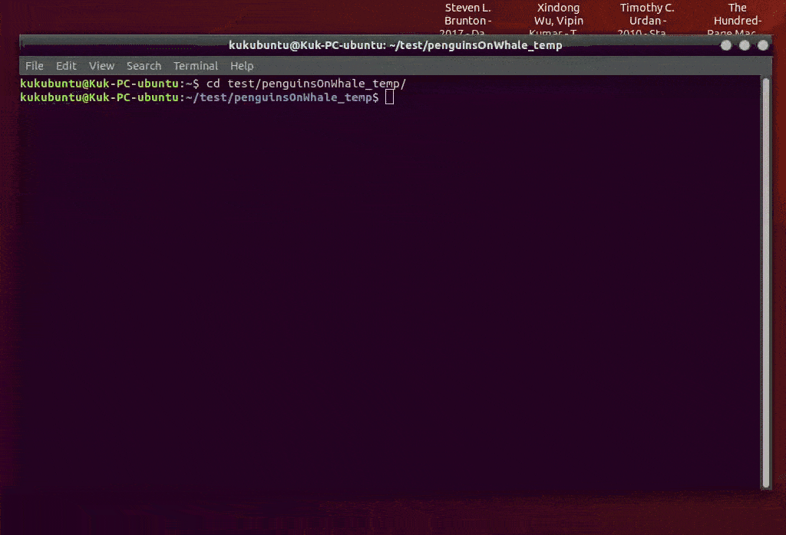

# penguinsOnWhale

Run multiple Docker containers each in a separate terminal with a single command.




### Requirements/Dependencies

 - bash 4 or 5
 - Python >3.6
 - Docker >19.03.0 or podman >2.0.2
 - GNOME Terminal >3.27.0


### Installation

Download and run:

```bash
./penguinsOnWhale --install
```
or 
```bash
sudo ./penguinsOnWhale --install
```

Follow the instructions


### Supported terminals
Supported | Ubuntu  | Debian | OpenSUSE | Fedora | Linux Mint | CentOS | Arch | Tails | Elementary OS
--- | --- | --- | --- | --- | --- | --- | --- | --- | ---
aTerm | :x: | :x: | :x: | :x: | :x: | :x: | :x: | :x: | :x:
Eterm | :x: | :x: | :x: | :x: | :x: | :x: | :x: | :x: | :x:
**GNOME Terminal** | :heavy_check_mark: | :heavy_check_mark: | :grey_question: | :heavy_check_mark: | :grey_question: | :grey_question: | :grey_question: | :grey_question: | :grey_question: | 
Hyper | :x: | :x: | :x: | :x: | :x: | :x: | :x: | :x: | :x:
Guake | :x: | :x: | :x: | :x: | :x: | :x: | :x: | :x: | :x:
Konsole | :x: | :x: | :x: | :x: | :x: | :x: | :x: | :x: | :x:
Nautilus Terminal | :x: | :x: | :x: | :x: | :x: | :x: | :x: | :x: | :x:
rxvt | :x: | :x: | :x: | :x: | :x: | :x: | :x: | :x: | :x:
Terminator | :x: | :x: | :x: | :x: | :x: | :x: | :x: | :x: | :x:
Tilda | :x: | :x: | :x: | :x: | :x: | :x: | :x: | :x: | :x:
XFCE4 Terminal | :x: | :x: | :x: | :x: | :x: | :x: | :x: | :x: | :x:
XTerm | :x: | :x: | :x: | :x: | :x: | :x: | :x: | :x: | :x:
VTE Terminal | :x: | :x: | :x: | :x: | :x: | :x: | :x: | :x: | :x:


### Usage

Help output:

```
Usage: penguinsOnWhale <COMMAND> [<penguin> [<penguin> [...]]]
  or:  penguinsOnWhale [<option>]

Commands:
  run                    invokes a terminal and starts a docker container for each specified penguin
  all                    invokes a terminal and starts a docker container for all penguins in the config file
  here                   starts a single penguin in the current terminal
  create-config          creates a new example config file in the current directory
  create-config-full     creates a new extensive example config file, demonstrating all available features
  reinstall              runs an installation script located at "/opt/penguinsOnWhale/installator.sh"


options:
  -h, --help         as a first keyword, displays this message. Run 'penguinsOnWhale <COMMAND> --help' for more info on a command
  -v, --version      displays general info about the program


```


Default config file (created with `penguinsOnWhale create-config`):

```
[Settings]
docker_images_prefix = 
docker_mount_source = 
docker_mount_destination = 
terminal_profile = penguinsOnWhale
cmd = ls
cmd_arg1 = -la

[penguin "ubuntu18.04"]
terminal_name = Ubuntu 18.04
docker_image = ubuntu:18.04
docker_container = myReusableUbuntu1804container
reuse_container = True

[penguin "fedora31"]
terminal_name = Fedora 31
docker_image = fedora:31

[penguin "amazonlinux2"]
terminal_name = Amazon Linux 2
docker_image = amazonlinux:2

```
use `penguinsOnWhale create-config-full` to check out more features
